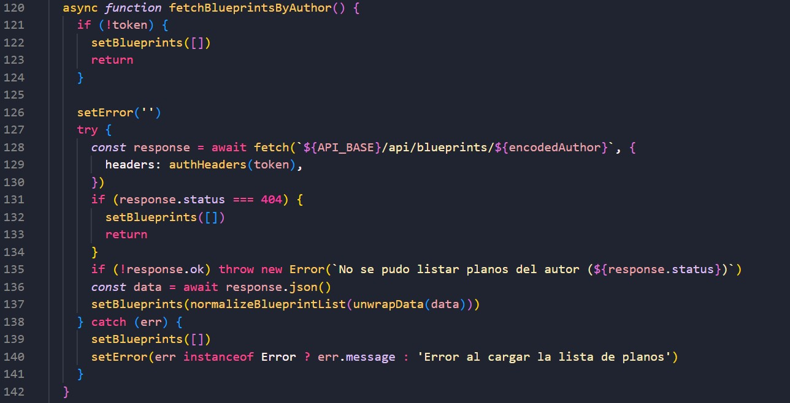
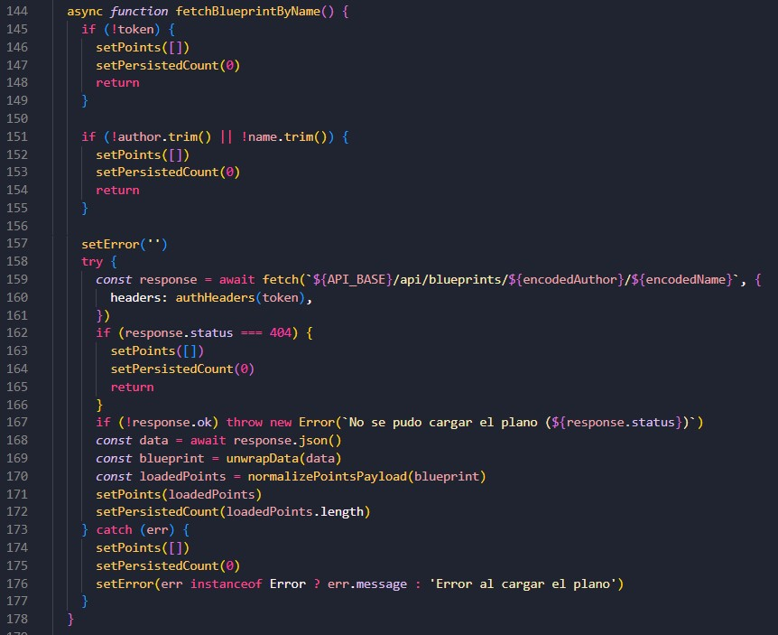
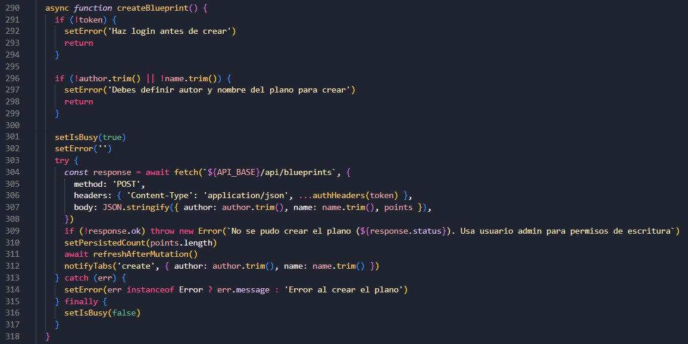
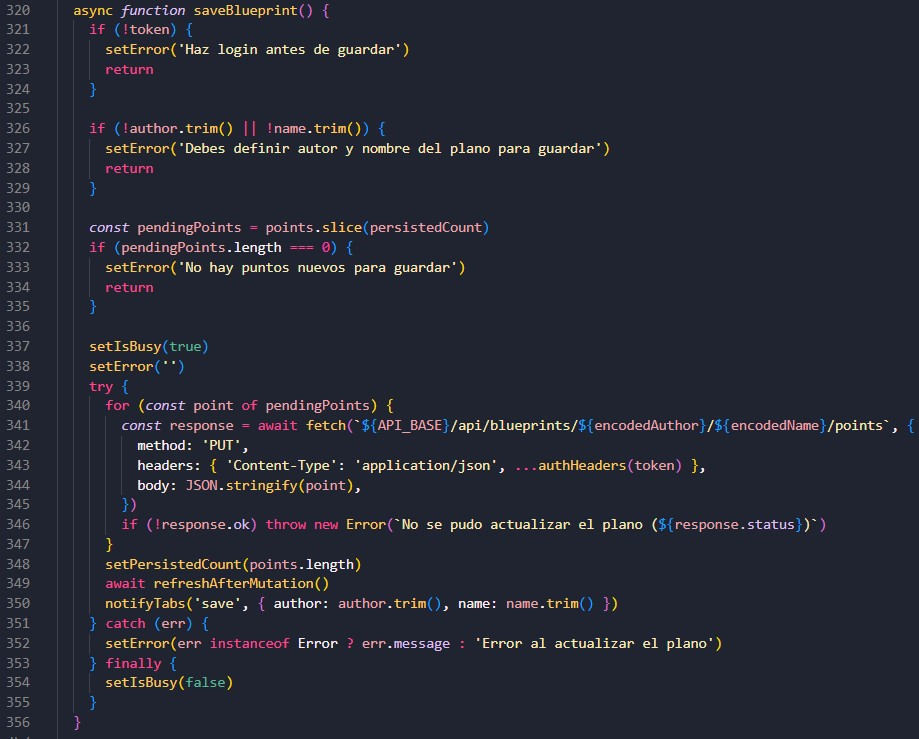
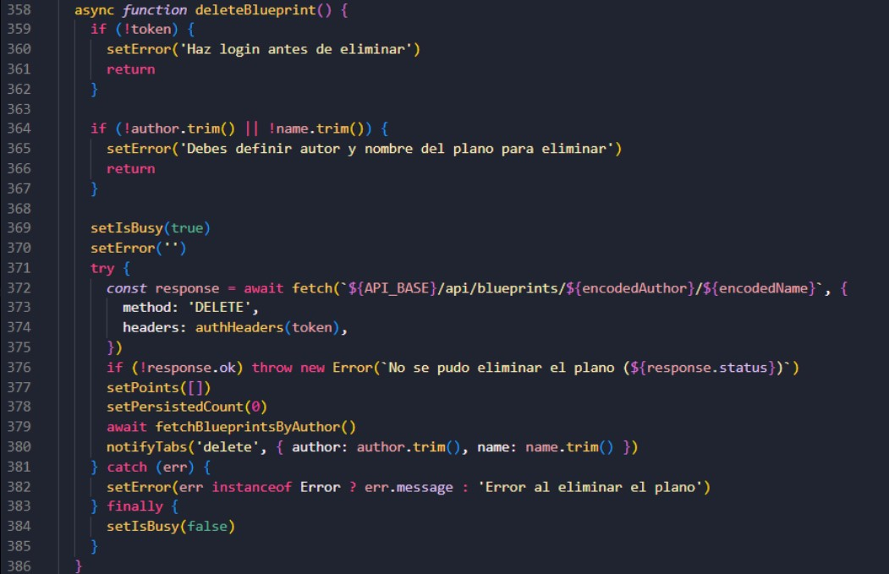
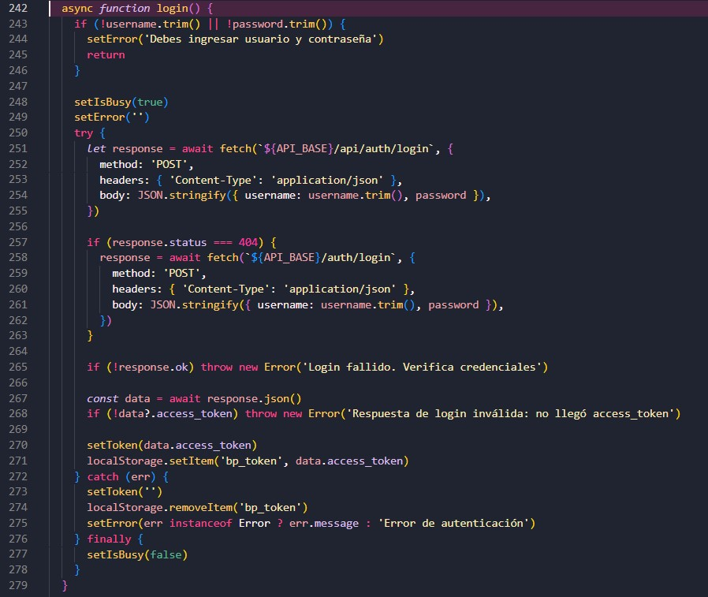
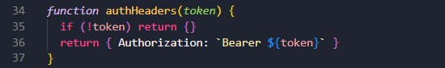
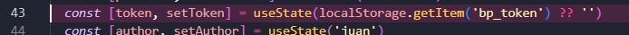
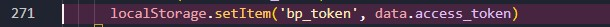
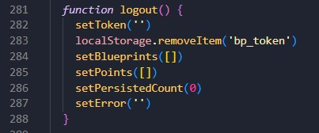

# 📘 BluePrints Real Time — Laboratorio 7

Front-end en React + Vite para el laboratorio de colaboración en tiempo real de BluePrints.

Este README tiene la información correspondiente a **los cambios realizados en el proyecto** para cumplir lo pedido en el laboratorio (CRUD + tiempo real + demostración en video).

---

## 🐱‍🏍 Resumen de lo implementado

- Integración con API REST para listar, cargar, crear, actualizar y eliminar planos.
- Dibujo en canvas por clic con actualización incremental de puntos.
- Colaboración en tiempo real usando **Socket.IO**.
- Cálculo del total de puntos por autor en la tabla.
- Manejo de autenticación con token JWT para operaciones protegidas.
- Sincronización entre pestañas para refrescar estado después de Create/Save/Delete.

---

## 🤺 Cambios que tuvimos que realizar para cumplir con lo pedido en el laboratorio

### ✏ Ajustes para integración entre el Back y el Front
Se ajustó el front (específicamente el [App.jsx](src/App.jsx) para usar los endpoints disponibles en nuestro backend realizado en el laboratorio pasado:

- `GET /api/blueprints/:author` para --> lista por autor.

- `GET /api/blueprints/:author/:name` para --> cargar un plano.

- `POST /api/blueprints` para --> crear plano.

- `PUT /api/blueprints/:author/:name/points` para --> guardar puntos nuevos de forma incremental.

- `DELETE /api/blueprints/:author/:name` para --> eliminar plano.


### 🔏 Autenticación para acciones de escritura
Se agregó login con JWT para permitir operaciones de escritura:

- Login por `POST /api/auth/login` y fallback a `POST /auth/login`.


- Uso de `Authorization: Bearer <token>` en requests protegidos.


- Persistencia de token en `localStorage`.



- Logout limpiando token y estado local.


### ⏱ Tiempo real con Socket.IO
Se implementó la colaboración en vivo:

- Conexión del cliente Socket.IO con transporte websocket.
- Unión a sala por blueprint usando: `blueprints.{author}.{name}`.
- Emisión de eventos de dibujo: `draw-event`.
- Recepción de actualizaciones remotas: `blueprint-update`.

### 🎨 UI
Se agregó en la UI:

- Inputs para `author` y `name`.
- Botones `Create`, `Save/Update`, `Delete`.
- Tabla de planos por autor junto con el total de puntos.
- Canvas interactivo para dibujo.

---

## 🤔 Decisiones técnicas del equipo

- **Tecnología RT elegida para la demo:** Socket.IO.
- **Separación por plano:** una room por combinación autor/nombre.
- **Manejo del guardado:** actualización incremental por puntos nuevos (no se reenvía todo el plano cada vez).

---

## ⚙ Configuración del entorno

Crear `.env.local` en la raíz del proyecto:

```bash
VITE_API_BASE=http://localhost:8080
VITE_IO_BASE=http://localhost:3001
```

Instalación y ejecución:

```bash
npm install
npm run dev
```

Front: `http://localhost:5173`

---

## 🎥 Contenido del video

En el video se encuentran el proceso que permite evidenciar el cumplimiento cumplimiento de los casos de prueba mínimos planteados. Que corresponde a:

- **Estado inicial:** al seleccionar plano, el canvas carga puntos (GET /api/blueprints/:author/:name).
- **Dibujo local:** clic en canvas agrega puntos y redibuja.
- **RT multi-pestaña:** con 2 pestañas, los puntos se replican casi en tiempo real.
- **CRUD:** Create/Save/Delete funcionan y refrescan la lista y el Total del autor.


🚨🚨 **El link al video con la demostración:**
[Link de OneDrive](https://1drv.ms/v/c/7297bdd241a2d24c/IQCDQpxUUYmLTKckVMxSyfd2Aa5Sv8WezAjiAXRyIv8wmFw?e=ta58xe)
[Link de YouTube](https://www.youtube.com/watch?v=5rr6zoON5tI)

**Nota:** Son el mismo video, solo que se mandaron 2 links para evitar problemas.

---

## 📁 Estructura del proyecto

```text
📁 img/ --> imágenes usadas en el readme
📁 src/ --> proyecto
  App.jsx
  main.jsx
  📁 lib/
    socketIoClient.js
    stompClient.js --> 🚨 Este .js no se tocó
```

---

## 👥 Autores

| Nombre | GitHub |
|--------|--------|
| **María Belén Quintero** | [@mbquial](https://github.com/mbquial) |
| **Nikolas Martínez Rivera** | [@NikoMAR3](https://github.com/NikoMAR3) |